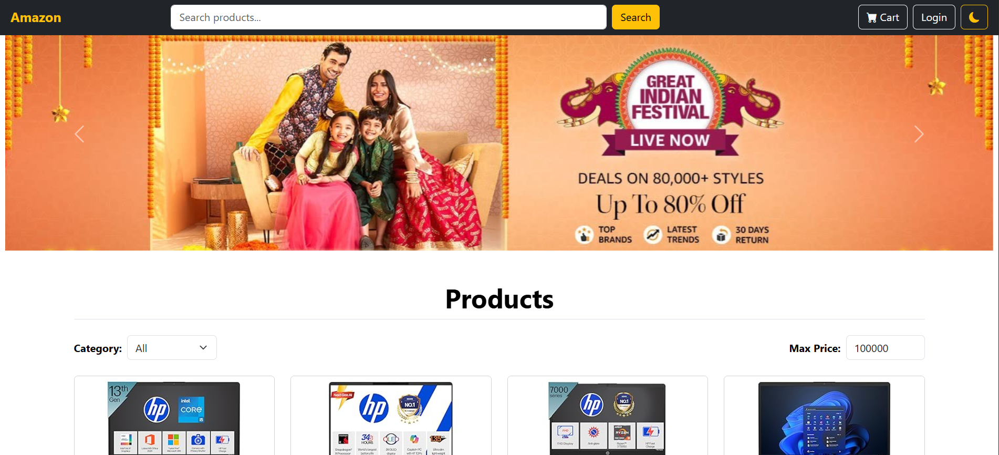

# Amazon E-commerce Store Clone

A fully responsive Amazon-inspired e-commerce app built with React, Redux, and Bootstrap.  
Browse products, add to cart, login for checkout, switch themes, and enjoy a seamless experience across devices.

---

## 🚀 Live Demo

[View Deployed App on Netlify](https://https://ecommercestoreclone.netlify.app/)

[](https://app.netlify.com/projects/ecommercestoreclone/deploys)(https://ecommercestoreclone.netlify.app/)

---

## 📂 Source Code

Visit the GitHub repository to explore the source code:

[https://github.com/yashshetty776/Ecommerce_Store](https://github.com/yashshetty776/Ecommerce_Store)

---

## ✨ Features

- **Modern UI:** Amazon-like navbar, search bar, product grid, and promotional banners.
- **Theme Toggle:** Light & dark mode switch for enhanced accessibility.
- **Product Catalog:** Search, filter by category and max price.
- **Product Details:** View product image, title, category, price, ratings, reviews, and description.
- **Shopping Cart:** Add, update, remove products; persistent across sessions.
- **Authentication:** Ensures purchase only after user login.
- **Error Handling:** App-wide error boundary for graceful fallbacks.
- **Mobile Responsive:** Smooth experience on all screen sizes.

---

## 🛠️ Tech Stack

- **React** (v19)
- **Redux**
- **React Router**
- **React Bootstrap**
- **React-Hook-Form**

---

## 📦 Installation & Setup

### Prerequisites

- Node.js and npm

### Steps

1. Clone the repository:
    ```
    git clone https://github.com/yourusername/ecommerce_store.git
    cd ecommerce_store
    ```
2. Install dependencies:
    ```
    npm install
    ```
3. Start the development server:
    ```
    npm run dev
    ```
    Visit [http://localhost:3000](http://localhost:3000) in your browser.

---

## 📂 Product Data Source
The product details displayed in this application are sourced by scraping data from Amazon's website and hosted as a static JSON file on GitHub Pages. This setup allows the frontend to fetch product information efficiently without relying on a backend server.

- **Data Source:** Amazon product listings (scraped for demonstration)

- **Hosting:** Static JSON hosted at: https://yashshetty776.github.io/sample_product_details/products/

- **Usage:** The frontend fetches product data from this URL at runtime to display product listings.

---

## 🎯 Usage

- **Browse Products:** Use the search bar, category filter, and max price input.
- **View Details:** Select any product for full information.
- **Add to Cart:** Use the product detail page to add to cart or buy now.
- **Checkout:** Requires login for purchase.
- **Theme Switch:** Click theme icon in navbar (top-right).
- **Loader Skeletons:** Displayed during initial product fetch.
- **Error Handling:** Displays a reload prompt on unexpected errors.

---

## 📷 Screenshot



---

